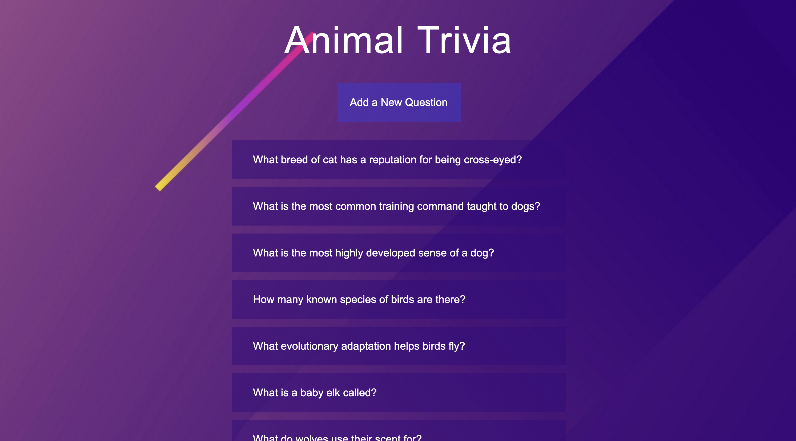
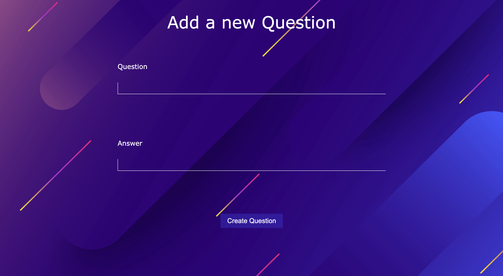
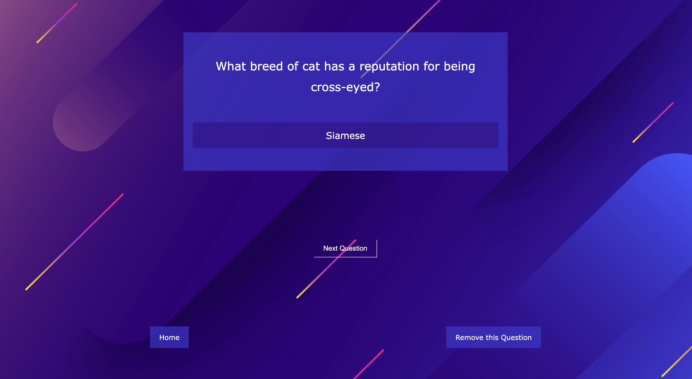

<h1 align="center">ANIMAL TRIVIA</h1>

## Description
Animal quiz app. On the main page you can see a list of questions, after going to the question page the answer will be displayed. From the answer page, you can go to the next question or delete the current or return to the home page. You can also add your own question.

<p align="center">







</p>

### About the project.
The project is completely done with FLASK. For the front-end part HTML and CSS were used. The json file was used as data storage.

## Project setup

Inside Terminal:

```
On Mac
python3 app.py run

Windows
python app.py run
```